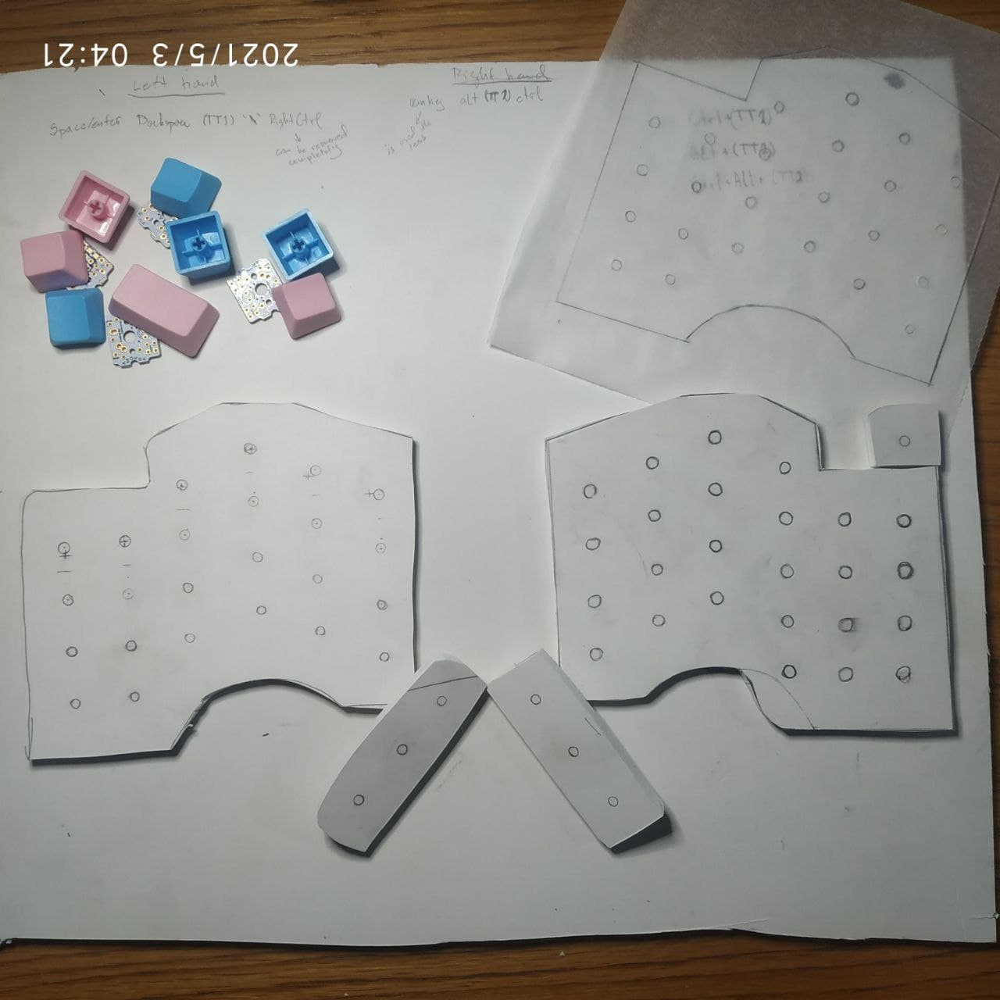

# Notes

After some /fairly passive/ research I have decided on the rough shape and layout for the next iteration of `qibord`.

I will not go into much detail here but rather list the key ideas behind it.

Below are the pieces of the plates, that will go into `qibord2`.

The image displays both main pads and thumb pads. The circles roughly mark the key positions. I will next, model the 3D shape with plastiline and these patches.

## 3D

The issue with `qibord1` is that it is _2D_. This, however, is not a strict restriction. There are keyboards out there that have slopes and elevations. Thou fairly obvious, this idea has eluded me somehow. `qibord2` is heavily inspired by [ZSA Moonlander](https://www.zsa.io/moonlander/) and will also utilize all three dimensions.

_Honorable mentions_: [Dactyl Manuform](https://github.com/abstracthat/dactyl-manuform)

## Column staggered

`qibord1` was ortholinear. The idea of strictly moving up and down with your fingers for typing is good. Keys are easier to find and there are fewer misses. I am still slow on it but it's only a matter of practice. The hand, however, has to maintain an unnatural curve to align all the fingers on the rows. Also, some movements are straining since it is uncomfortable to curve some fingers inwards. To fix this, `qibord2` will be column staggered.

## Thumbs

`qibord1` forced thumbs into very uncomfortable positions and movements, curving inwards and to the side, since all the keys for the thumb were on the lowest row of the plate. It is more comfortable to stretch it out, and this can easily be achieved by shifting the lowest row to the left or right for right and left hands respectively. The situation can be improved even more, if we utilize tilted plates, as [ZSA Moonlander](https://www.zsa.io/moonlander/) does.

## Keymap

With `qibord2` we attempt to group all the control keys on the left. As a consequence the **RIGHT CTRL** was removed entirely (also, since I rarely use it).

### Left thumb

The left thumb is now responsible for pressing **TT2**, **ALT** and **LEFT CONTROL**

### Right thumb

The right thumb is now responsible for pressing **TT1**, **SPACE/ENTER**, and **BACKSPACE**

### **SPACE** and **ENTER**

**SPACE** and **ENTER** had to be combined on `qibord1` because I snipped off a capacitor while trimming diode pins after soldering. This turned out to be a very comfortable setting thou. `qibord2` has them mapped to the same key under the right thumb intentionally.

### **WINKEY/OS/META/MASTER/...**

This key was moved to the top right of the right plate to be pressed by pinky. This idea has yet to be validated with the 3D plastiline model.
